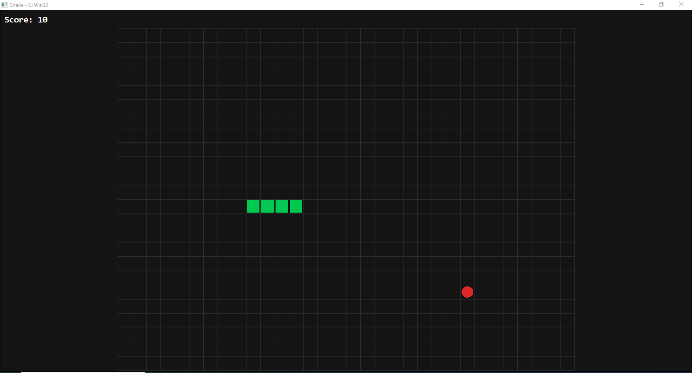
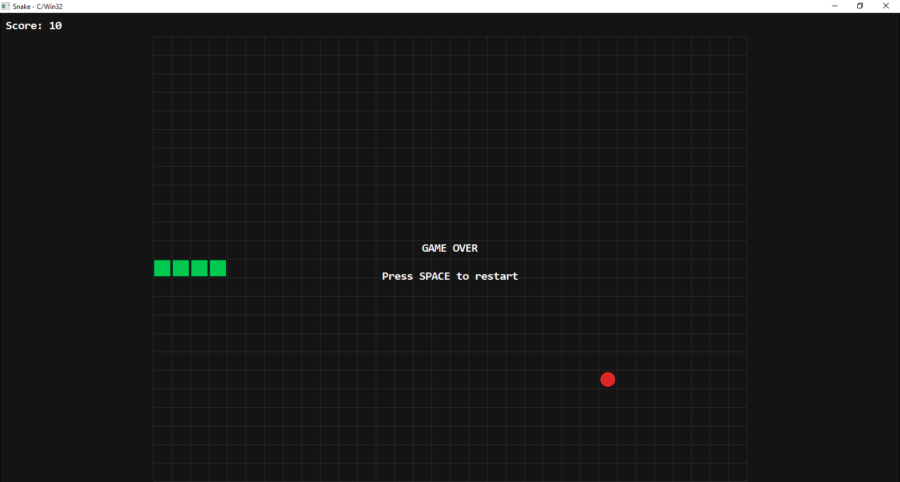

Змейка (Snake) — Семестровый проект на C + Win32 API

Описание игры
Классическая аркадная игра «Змейка», реализованная на чистом языке C с использованием Win32 API и GDI. Проект разработан в строгом соответствии с техническим заданием: модульная архитектура, фиксированный игровой шаг, двойная буферизация, отсутствие сторонних библиотек и C++ конструкций. Окно поддерживает изменение размера, игровое поле автоматически масштабируется и центрируется, интерфейс не перекрывает рабочую область.

Управление
'↑' '↓' '←' '→' - Изменение направления движения змейки 
'Pause' - Пауза / Продолжить 
'Space' / 'Enter' - Перезапуск игры после Game Over 
'Alt + F4' - Закрытие окна 

Инструкция по сборке
Проект собирается из командной строки без использования IDE или сторонних систем сборки. Требуется компилятор, поддерживающий стандарт C99/C11 и Win32 API.

MinGW-w64 (GCC)
gcc -std=c11 -O2 -Wall -Wextra -mwindows -o snake.exe main.c core.c ui.c -lgdi32

Скриншоты

Реализованные модули
Проект строго разделён на два независимых модуля согласно ТЗ:
core(core.c, core.h) - игровое состояние (GameState), движение змейки, коллизии со стенами и собой, генерация еды, фиксированный шаг обновления (0.15s), обработка ввода на уровне логики.
ui(ui.h, ui.c) - создание окна Win32, обработка сообщений (WndProc), двойная буферизация (GDI), отрисовка сетки/змейки/еды/UI, динамический ресайз с сохранением пропорций, игровой цикл на QueryPerformanceCounter.